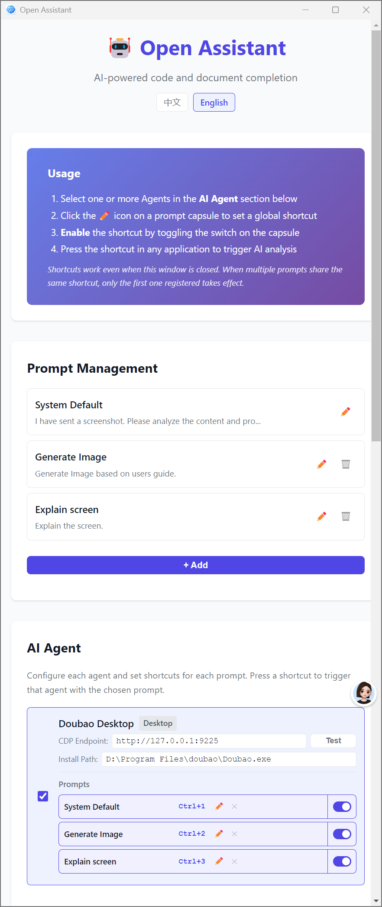

# Open Assistant

[中文版](README_ZH.md)

AI-powered code and document completion assistant. Captures your screen, sends it to an AI agent (e.g., Doubao Desktop), and waits for the AI to insert the generated response at your cursor.



## How It Works

1. Configure one or more AI agents and write prompts
2. Assign a global keyboard shortcut to each prompt you want to use
3. Press the shortcut anytime — the assistant screenshots your screen, sends it to the AI with the chosen prompt, and waits for the AI to insert the response

## Features

- **Multi-Agent Support** — Manage multiple AI agents (Doubao Desktop, etc.) from one interface
- **Per-Prompt Shortcuts** — Each prompt gets its own global hotkey. No more "select then trigger"
- **Two Capture Modes**
  - **SSE Fetch** — Intercepts the AI response at the network level. Works even when the chat window is minimized to tray
  - **DOM Poll** — Retrieves responses by polling the DOM of the Doubao chat page
- **Two Output Modes**
  - **Streaming** — Pastes text incrementally as the AI generates it
  - **Full** — Waits for the complete response, then pastes at once
- **Streaming Clipboard** — Preserves your original clipboard content and restores it after pasting
- **System Tray** — Runs quietly in the system tray. No window needed
- **Auto-Detect Install Path** — Finds the Doubao executable automatically on startup
- **Custom Prompts** — Create, edit, and delete prompt templates in the settings UI

## Quick Start

```bash
# Install dependencies
npm install

# Run in development mode
npm run dev

# Or run normally
npm start
```

### Build for Distribution

```bash
# All platforms
npm run build

# Platform-specific
npm run build:win
npm run build:mac
npm run build:linux
```

## Usage

1. Open the settings window from the system tray
2. Set the CDP endpoint for each agent in its card (e.g., `http://127.0.0.1:9225`). Different agents can use different ports — the port is just an example
3. Click **Initialize** in the agent card or **Initialize Doubao** in the tray menu to launch the agent with remote debugging
4. In each agent card, click the ✏️ icon on a prompt capsule to assign a global shortcut
5. Press the shortcut in any application to trigger the assistant

## Troubleshooting

### Cannot connect to the AI agent
- Use **Initialize** in the agent card, or **Initialize Doubao** in the tray menu to start the agent with the correct debugging port
- Check whether the port is blocked by a firewall

### Shortcut not working
- Check for shortcut conflicts with other applications
- Try a different shortcut combination
- On macOS, grant Accessibility permissions to the app

### Results not inserting
- Ensure **Auto Insert** is enabled in settings
- Make sure the editor you are using keeps focus while waiting for the AI response

## License

Apache-2.0
